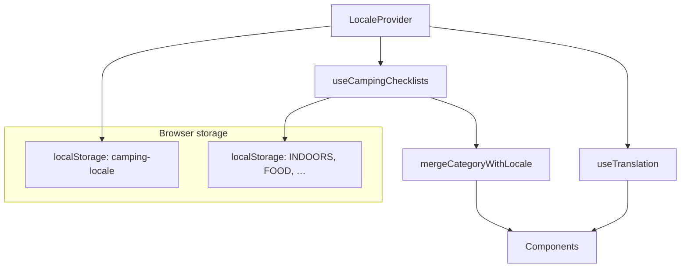

# Camping Checklist i18n (Bulgarian Default)

**Date:** 2026-06-22  
**Status:** Approved  
**Approach:** Lightweight custom i18n (React context + typed locale maps)

## Goal

Make Bulgarian the default in-app language for all user-facing content (UI strings, category titles, and checklist items), with a header toggle to switch to English. Preserve existing checklist progress across language changes and return visits.

## Requirements (decisions)

| Topic | Decision |
|---|---|
| Translation scope | UI + category names + all checklist items |
| Default language | Always Bulgarian on first visit (no browser auto-detect) |
| Language persistence | `localStorage` key `camping-locale` (`'bg'` \| `'en'`) |
| Checkmarks on switch | Shared — same item IDs, same `localStorage` category keys |
| SEO / OG / static HTML | Stay English-only (`public/index.html`, OG image unchanged) |
| Toggle placement | Compact control in sticky header title row |
| Translations | Implemented in code; user reviews Bulgarian copy after |

## Architecture



**Principle:** State (item IDs + `isChecked`) lives in existing category `localStorage` keys. Text comes from locale maps at render time via merge. Switching language re-renders labels only.

**Accessibility:** Update `document.documentElement.lang` to `bg` or `en` when locale changes. Static `<html lang>` in `index.html` is unchanged.

## Data model

### Stable item IDs

Replace runtime `uuidv4()` in `checklist.ts` with **fixed UUID constants** in `src/data/item-ids.ts`.

**Migration:** UUIDs today are generated at runtime on first visit and saved to `localStorage`. Each user/device may have different IDs. Before shipping fixed IDs:

1. Add `src/data/item-ids.ts` with stable constants (new canonical IDs).
2. Implement **legacy merge** in `mergeCategoryWithLocale`:
   - Match stored `isChecked` to catalog items by **id** (already migrated users).
   - Else match by **English text** (stored `text` vs `items.en[id]`).
   - Else match by **index** within the category (last resort, same ordered list).
3. Output always uses fixed catalog IDs + active locale text.
4. On next persist, `localStorage` is rewritten with fixed IDs (one-time transparent migration).

Run a one-off script against current `checklist.ts` only to document the ordered item list for translation — not to preserve old random UUIDs as constants.

Each category export in `checklist.ts` becomes structure-only: ordered list of `{ id, isChecked: false }` plus `expiry`. No embedded English text.

### Category registry

`src/data/categories.ts` keeps language-neutral fields:

- `storageKey` (unchanged, e.g. `INDOORS`, `FOOD`)
- `anchorId`, `iconId`
- `defaultData` reference

Remove hardcoded `displayTitle` from the registry; titles come from i18n maps keyed by `storageKey`.

### Locale maps

```
src/i18n/
  locale.ts           # Locale type, DEFAULT_LOCALE = 'bg', storage helpers
  locale-context.tsx  # LocaleProvider, useLocale(), useTranslation()
  ui.ts               # UI strings per locale
  categories.ts       # displayTitle per storageKey per locale
  items.ts            # item text per item id per locale
```

`useTranslation()` returns a typed `t(key)` for UI strings and helpers for interpolated phrases (progress labels, dialog titles with category name).

### Merge logic (`mergeCategoryWithLocale`)

Used on initial load and when locale changes:

1. Build default category data from registry + locale item text map (fixed IDs).
2. Read stored category blob from `localStorage` (if valid and not expired).
3. For each catalog item, resolve `isChecked` from stored data using id → English text → index matching (see Legacy migration).
4. Ignore stored entries that match nothing (orphaned).
5. Output uses catalog order, fixed IDs, and active locale text.

**Persist on change:** Continue writing full category blobs to `localStorage` on state change (existing `useEffect` pattern). Text in stored JSON may reflect the active locale at save time; merge always applies locale maps for display text, so stored text is not authoritative.

### Locale storage

- Key: `camping-locale`
- Valid values: `'bg'`, `'en'`
- Missing, corrupt, or invalid → `'bg'`
- Same try/catch, non-throwing pattern as checklist persistence

## UI

### Language toggle (header)

**Location:** `ProgressHeader` title row — right side, beside fraction badge; wraps on narrow viewports.

**Control:** Segmented toggle `БГ | EN`

- Active segment: highlighted (reuse accent / toggle active styles)
- Inactive segment: plain button
- `aria-label`: locale-aware (“Смяна на език” / “Switch language”)
- Clicking inactive segment calls `setLocale('bg' | 'en')` and persists to `localStorage`

### Components to internationalize

| Component | Strings |
|---|---|
| `ProgressHeader` | App title, show all/remaining, clear all, jump to…, all packed, progress aria-labels, clear-all dialog |
| `Checklist` | Clear, section clear dialog (title includes category name) |
| `ConfirmDialog` | Default cancel/confirm labels |
| `Footer` | Scroll-to-top `title` and `aria-label` |

All user-visible copy flows through `useTranslation()` or merge output — no hardcoded English/Bulgarian in components after implementation.

### Draft Bulgarian UI copy (for review)

| Key | Bulgarian | English |
|---|---|---|
| `app.title` | Списък за къмпинг на Ceko | Ceko's Camping Checklist |
| `showRemaining` | Покажи оставащите | Show remaining |
| `showAll` | Покажи всички | Show all |
| `clearAll` | Изчисти всичко | Clear all |
| `jumpTo` | Към… | Jump to… |
| `allPacked` | Всичко е опаковано! | All packed! |
| `progressLabel` | {checked} от {total} опаковани, {percent} процента | {checked} of {total} items packed, {percent} percent |
| `allItemsPacked` | Всички артикули са опаковани | All items packed |
| `clearSection` | Изчисти | Clear |
| `clearAllConfirm.title` | Да изчистя ли всички отметки? | Clear all checkmarks? |
| `clearAllConfirm.message` | Това ще махне отметките от всички категории. Артикулите няма да бъдат изтрити. | This will uncheck every item in all categories. Your items will not be deleted. |
| `clearSectionConfirm.title` | Да изчистя ли {category}? | Clear {category}? |
| `clearSectionConfirm.message` | Това ще махне отметките от тази категория. | This will uncheck all items in this category. |
| `confirm` | Потвърди | Confirm |
| `cancel` | Отказ | Cancel |
| `clearSectionConfirm.confirm` | Изчисти секцията | Clear section |
| `scrollToTop` | Към началото | Go to the top |
| `switchLanguage` | Смяна на език | Switch language |
| `jumpCategoriesAria` | Към категории с оставащи артикули | Jump to categories with remaining items |
| `sectionComplete` | Завършена | Complete |

### Draft Bulgarian category titles

| storageKey | Bulgarian | English |
|---|---|---|
| `INDOORS` | В палатката | Indoors |
| `OUTDOORS` | На открито | Outdoors |
| `FURNITURE` | Мебели и сянка | Furniture |
| `CLOTHES AND SHOES` | Дрехи и обувки | Clothes and shoes |
| `FOOD` | Храна | Food |
| `HYGIENE AND TOILETRIES` | Хигиена и тоалетни принадлежности | Hygiene and toiletries |
| `RECREATIONAL GEAR` | Свободно време | Recreational gear |
| `CLEAN-UP` | Почистване | Clean-up |
| `SAFETY` | Безопасност | Safety |
| `FIRST-AID` | Първа помощ | First-aid |
| `PERSONAL BELONGINGS` | Лични вещи | Personal belongings |

Checklist item translations (~76 items) live in `src/i18n/items.ts`, keyed by stable item ID. Full Bulgarian strings are authored during implementation for user review.

## Provider wiring

**File:** `src/index.tsx`

Wrap `<App />` with `<LocaleProvider>`.

**File:** `src/hooks/useCampingChecklists.ts`

- Consume locale from `useLocale()`
- On init and locale change: merge each category with active locale
- Include locale in memos that produce `displayTitle` and item `text`
- `categoryState` stores merged data; toggles update `isChecked` by id only

## Edge cases

| Case | Behavior |
|---|---|
| Missing `camping-locale` | Default `bg` |
| Invalid locale value | Default `bg` |
| localStorage read/write failure | Session-only; no throw |
| Stored item ID unknown to catalog | Ignore (drop orphaned check) |
| New item added in a future release | Unchecked until user toggles |
| Expired category blob | Fall back to locale defaults (existing expiry logic) |

## Out of scope

- URL-based locale (`/en`, query params)
- Browser language auto-detect
- SEO, Open Graph, `sitemap.xml`, or static meta translation
- Third language (structure allows adding later)
- Translating `public/manifest.json` display strings (optional follow-up)

## Files changed (expected)

```
src/data/item-ids.ts                    (new)
src/data/checklist.ts                   (refactor — fixed IDs, no inline text)
src/data/categories.ts                  (remove displayTitle from registry)
src/i18n/locale.ts                      (new)
src/i18n/locale-context.tsx             (new)
src/i18n/ui.ts                          (new)
src/i18n/categories.ts                  (new)
src/i18n/items.ts                       (new)
src/i18n/mergeCategoryWithLocale.ts     (new)
src/i18n/mergeCategoryWithLocale.test.ts (new)
src/hooks/useCampingChecklists.ts       (locale-aware merge)
src/index.tsx                           (LocaleProvider)
src/components/progress-header/progress-header.component.tsx
src/components/progress-header/progress-header.module.css
src/components/checklist/checklist.component.tsx
src/components/confirm-dialog/confirm-dialog.component.tsx
src/components/common/footer/footer.component.tsx
```

## Testing

### Automated

- `mergeCategoryWithLocale`: overlays checks by id; falls back to English text then index; ignores orphans; outputs fixed IDs
- `loadLocale` / `persistLocale`: default, round-trip, invalid fallback
- Existing `progressUtils` tests unchanged and passing
- `pnpm exec tsc --noEmit`
- `CI=true pnpm exec react-scripts test --watchAll=false`
- `pnpm run build`

### Manual

- [ ] First visit (no `camping-locale`) → Bulgarian UI and item text
- [ ] Toggle to EN → all text English; checkmarks unchanged
- [ ] Refresh → language preference remembered
- [ ] Toggle back to BG → checkmarks still shared
- [ ] Clear all / clear section dialogs in active locale
- [ ] Jump chips show localized category names
- [ ] Progress aria-labels localized
- [ ] `document.documentElement.lang` matches active locale
- [ ] Existing user with saved checkmarks (same deployment) retains progress after deploy
- [ ] View page source / share link preview — meta still English (unchanged)

## Success criteria

- [ ] Bulgarian default on first visit
- [ ] Header BG/EN toggle persists across visits
- [ ] All UI, categories, and items translatable; no hardcoded strings in components
- [ ] Checkmarks preserved when switching language
- [ ] Existing `localStorage` category keys unchanged
- [ ] Stable item IDs preserve production user progress
- [ ] No new npm dependencies
- [ ] Static SEO/OG remains English-only
