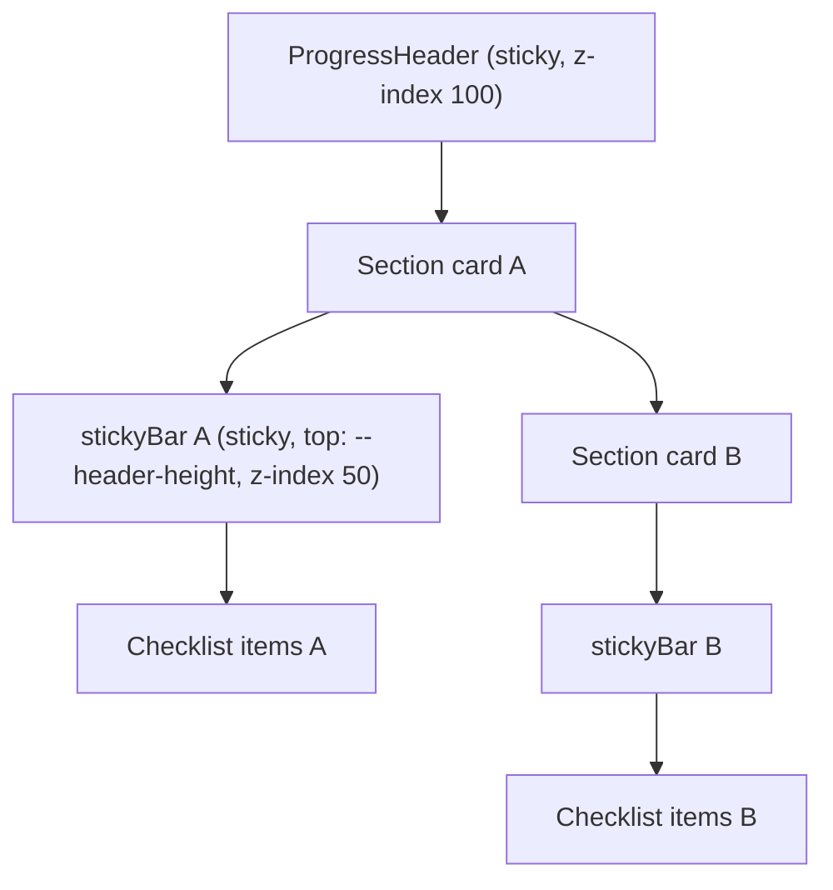

# Sticky Section Headers

**Date:** 2026-06-22  
**Status:** Approved  
**Approach:** Pure CSS `position: sticky` on a compact section bar

## Goal

Keep category context visible while scrolling through long checklist sections. When a section has many items, its header should remain pinned below the main progress header so users always know which section they are in.

## Problem

The main `ProgressHeader` is already sticky. Each category card has a header (icon, title, progress, Clear) followed by item rows. On mobile—and on desktop when a section is long—the category header scrolls off screen while the user is still checking items in that section.

## Requirements (decisions)

| Topic | Decision |
|---|---|
| Pattern | Sticky section header per category card |
| Breakpoints | All screen sizes (mobile, tablet, desktop) |
| Pinned content | Compact bar: icon, category name, progress (e.g. `3/13`, ✓ when complete) |
| Clear button | Not pinned — scrolls away with the top of the section |
| Pinned appearance | Subtle: card background, thin bottom border, no shadow |
| Implementation | Pure CSS — no scroll listeners or duplicate headers |

## Architecture



**Handoff:** Each section’s sticky bar pins only while its parent `<section>` is in view. When the user scrolls into the next section, the previous bar unsticks and the next section’s bar takes over.

**Offset:** `top: var(--header-height)` — already maintained by `useHeaderHeight` on the main header via `ResizeObserver`.

## Layout change

**File:** `src/components/checklist/checklist.component.tsx`

Restructure the section header:

```tsx
<section id={anchorId} className={wrapperClass}>
  <div className={styles.header}>
    <div className={styles.stickyBar}>
      <div className={styles.titleGroup}>
        <div className={styles.titleRow}>
          <CategoryIcon iconId={iconId} />
          <h2 className={styles.heading}>{displayTitle}</h2>
        </div>
        <span className={styles.sectionProgress}>…</span>
      </div>
    </div>
    <button type="button" className={styles.clearBtn}>…</button>
  </div>
  <div className={styles.checklist}>…</div>
</section>
```

- **At rest:** `.header` flex row — sticky bar on the left, Clear on the right (same visual layout as today).
- **While scrolling:** `.stickyBar` pins under the main header; Clear scrolls off with the section top.

## CSS

**File:** `src/components/checklist/checklist.module.css`

Add `.stickyBar`:

```css
.stickyBar {
  position: sticky;
  top: var(--header-height);
  z-index: 50;
  background: var(--color-surface);
  border-bottom: 1px solid var(--color-border);
  padding-bottom: 0.5rem;
  margin-bottom: 0.25rem;
  flex: 1;
  min-width: 0;
}
```

**Unchanged:**
- `.wrapper` `scroll-margin-top: var(--header-height)` for jump-to scroll
- `.wrapperComplete` green border for completed sections
- Main header `z-index: 100` in `progress-header.module.css`

**Z-index stack:** main header (100) → section sticky bar (50) → list items (default).

## Behavior notes

| Case | Behavior |
|---|---|
| Short sections | Sticky applies but may never pin if section fits in viewport — no negative effect |
| Two-column grid | Each card has independent sticky bar; only the scrolled section pins |
| Show remaining filter | Sticky bar shows full section title and total progress (unchanged semantics) |
| i18n | No new strings — uses existing `displayTitle` and progress |
| Completed sections | ✓ badge remains in sticky progress line |

## Out of scope

- Current-section indicator in main `ProgressHeader` (scroll-spy)
- Accordion / collapsible sections
- Pin/unpin animations
- Moving Clear into the sticky bar

## Files changed (expected)

```
src/components/checklist/checklist.component.tsx
src/components/checklist/checklist.module.css
```

## Testing

### Manual

- [ ] Scroll through a long section (Food, Clothes) — icon, title, and progress stay visible under main header
- [ ] Clear button scrolls away; not visible while pinned bar is active mid-section
- [ ] Scroll from one section into the next — previous bar unsticks, new bar pins
- [ ] Mobile single column and desktop two-column grid
- [ ] Jump-to chip lands section correctly (scroll-margin still works)
- [ ] Completed section styling and “Show remaining” unchanged
- [ ] Resize / expand jump panel — `--header-height` updates, sticky offset stays aligned

### Automated

- `pnpm exec tsc --noEmit`
- `CI=true pnpm exec react-scripts test --watchAll=false`
- `pnpm run build`

No new unit tests required (CSS-only behavior; manual QA is the primary verification).

## Success criteria

- [ ] Compact section header pins below main header on all screen sizes
- [ ] Clear button is not part of the pinned bar
- [ ] No new JavaScript or dependencies
- [ ] Existing scroll/jump and i18n behavior preserved
